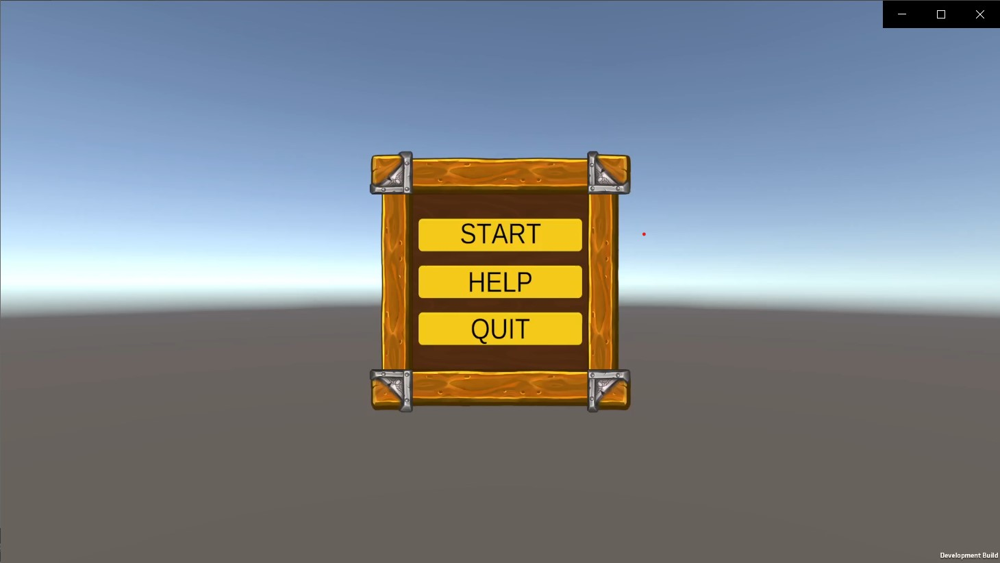
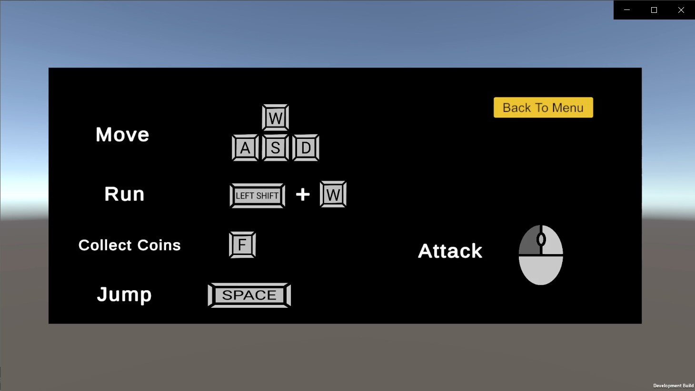
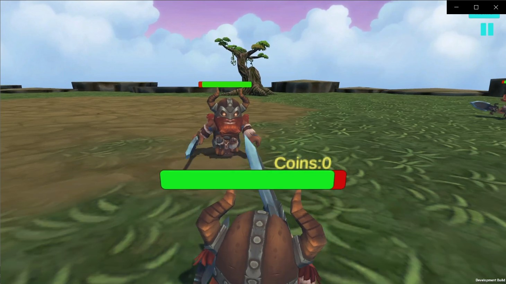
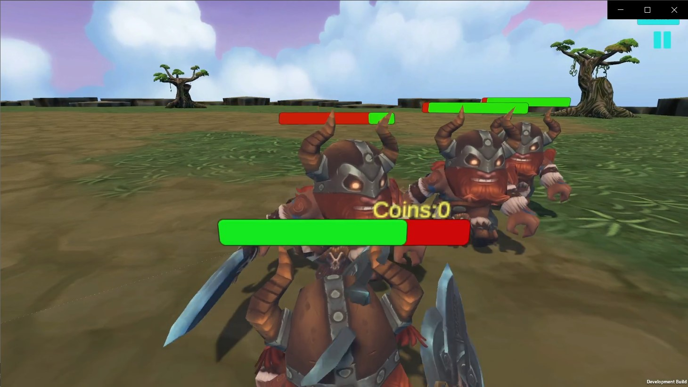
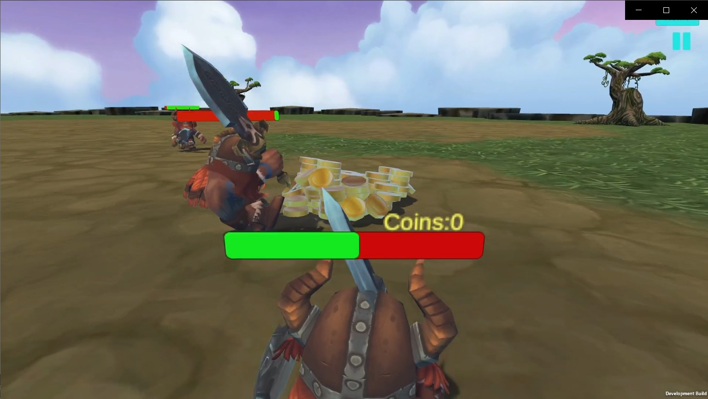
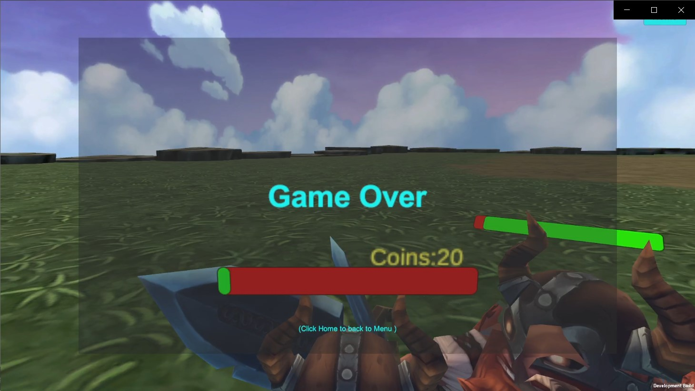
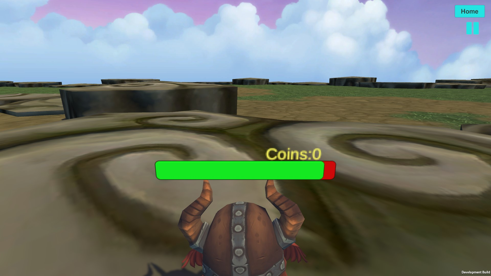

# Viking Valor - Coin Quest

## Environment

- C#
- Unity game engine
- desktop platform

## How to Download the Game

1. Download the "Viking Valor Coin Quest v1.0.zip" file.
2. Extract the contents of the zip file.
3. Double-click on the "Test_Project.exe" file to launch the game.

## Gameplay Instructions

1. Click to start the game.
2. Use WASD keys to control movement direction.
3. Press the Space key to jump.
4. Press SHIFT+W to sprint.
5. Control the view using the mouse.
6. Left-click to attack.
7. Press F to collect coins.

## Demo Video

[Demo Video Link (click here)](https://youtu.be/6m9y8dp-pX8)

## About the Game

- Defeating enemies earns coins. The game ends when the player's health reaches zero.
- Home
  
- How to Play
  
- If you get close enough to an enemy, they will chase after you
  
- Enemies spawn at random locations with a maximum limit
  
- Defeating enemies generates coins. Press F to collect coins
  
- Game ends when player's health reaches zero
  
- Map boundaries extend infinitely
  
